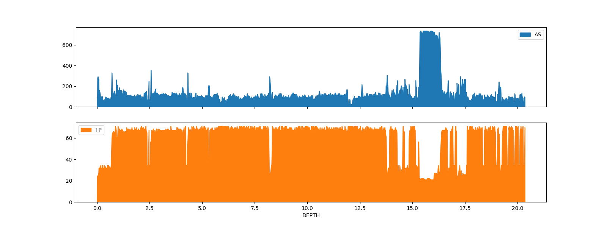

BOR-File
========

Small Python library to manipulate `BOR files`_

Installation
------------

Requirements:
  - python >= 3.8

You can install, upgrade, uninstall bor-file with these commands::

  $ pip install bor-file

To add support of exporting data to other formats (such as .zarr, .parquet or .xml)::

  $ pip install bor-file[extra]

Using a virtualenv may help overcome issues between python and your distribution.

Usage
-----

.. code-block:: python

  >>> import bor
  >>> bor_file = bor.read('./tests/data/parameters/DRILL/59650240611100849D.bor')

.. code-block:: python

  >>> bor_file.domain
  'DRILLING PARAMETERS'

.. code-block:: python

  >>> bor_file.description['borehole_ref']
  'TEST HOLE 1'

  >>> bor_file.description['drilling']['method']
  'DRLMTD_RTR'

BOR data can be used and edited as a `pandas DataFrame`_

.. code-block:: python

  >>> import pandas
  >>> pandas.set_option('display.precision', 2)
  >>>
  >>> bor_file.data
          DEPTH     AS    RV  EVP  EVR    TP    IP    TQ
  time
  0.0      0.00   76.1   0.0  0.0  0.0   0.1  21.1   0.1
  2.8      0.02   19.9   0.0  0.0  0.0  24.5  21.1  14.7
  3.0      0.03  278.9   0.0  0.0  0.0  24.5  21.1  14.7
  3.2      0.05  291.5   0.0  0.0  0.0  24.5  20.8  14.7
  3.4      0.06  253.5   0.0  0.0  0.0  25.7  20.6  17.2
  ...       ...    ...   ...  ...  ...   ...   ...   ...
  1220.6  20.29   47.5  22.0  0.0  0.0  34.3  20.6  40.4
  1221.6  20.30   38.0  22.0  0.0  0.0  34.3  20.6  36.7
  1222.6  20.31   40.6  55.0  0.0  0.0  34.3  21.1  46.5
  1223.8  20.33   95.1  11.0  0.0  0.0  31.8  17.3  42.8
  1224.6  20.35   93.0   0.0  0.0  0.0  69.7  16.5  25.7

  [1492 rows x 8 columns]

.. code-block:: python

  >>> bor_file.data.describe()
           DEPTH       AS       RV     EVP     EVR       TP       IP       TQ
  count  1492.00  1492.00  1492.00  1492.0  1492.0  1492.00  1492.00  1492.00
  mean      9.94   109.10    41.55     0.0     0.0    61.16    19.43    44.12
  std       5.86    79.71    62.75     0.0     0.0    14.61     1.71    10.94
  min       0.00     0.70     0.00     0.0     0.0     0.10    12.20     0.10
  25%       4.96    80.30     8.00     0.0     0.0    66.00    19.70    36.70
  50%       9.77   101.40    31.00     0.0     0.0    67.20    20.00    42.80
  75%      14.62   114.10    59.00     0.0     0.0    68.50    20.20    47.70
  max      20.35   735.20  1653.00     0.0     0.0    70.90    21.80   134.40

.. code-block:: python

  >>> bor_file.data.loc[:1]
        DEPTH    AS   RV  EVP  EVR   TP    IP   TQ
  time
  0.0     0.0  76.1  0.0  0.0  0.0  0.1  21.1  0.1

.. code-block:: python

  >>> bor_file.data.loc[0, 'DEPTH'] = 0.01
  >>> bor_file.data.loc[:1]
        DEPTH    AS   RV  EVP  EVR   TP    IP   TQ
  time
  0.0    0.01  76.1  0.0  0.0  0.0  0.1  21.1  0.1

.. code-block:: python

  >>> import matplotlib.pyplot as plt
  >>> bor_file.data.set_index('DEPTH').plot.area(figsize=(16, 6), y=['AS', 'TP'], subplots=True)

You can export the data in any format supported by the pandas DataFrame class

.. code-block:: python

  >>> bor_file.to_csv('/tmp/data.csv')
  >>> bor_file.to_json('/tmp/data.json')
  >>> bor_file.to_zarr('/tmp/data.zarr.zip', mode='w')  # need pip install bor-file[extra]
  >>> bor_file.to_xml('/tmp/data.xml')  # need pip install bor-file[extra]
  >>> bor_file.to_parquet('/tmp/data.parquet')  # need pip install bor-file[extra]

Changes can be made persistent with the `save` method..

.. code-block:: python

  >>> bor_file.save()

..or discarded with the `reset` method

.. code-block:: python

  >>> bor_file.reset()

.. _`pandas DataFrame`: https://pandas.pydata.org/docs/reference/api/pandas.DataFrame.html
.. _`BOR files`: https://bor-form.at/en/
